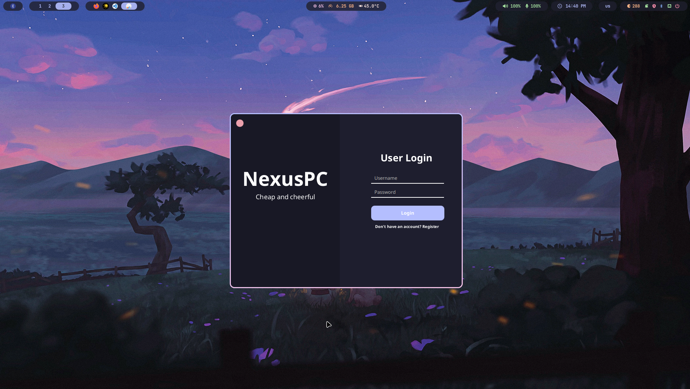
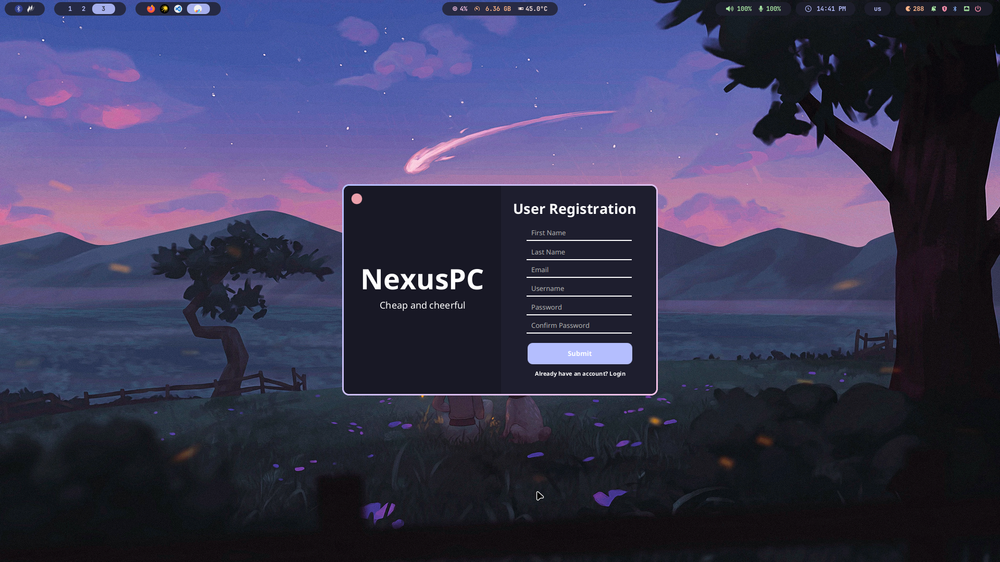
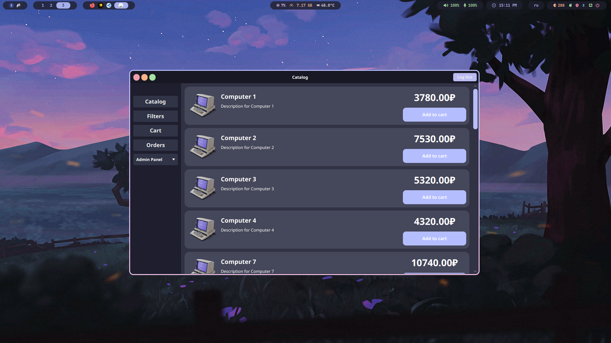
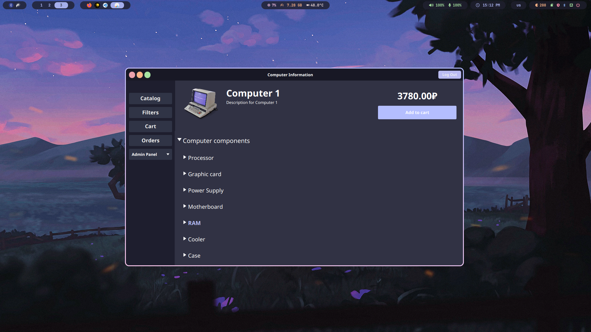
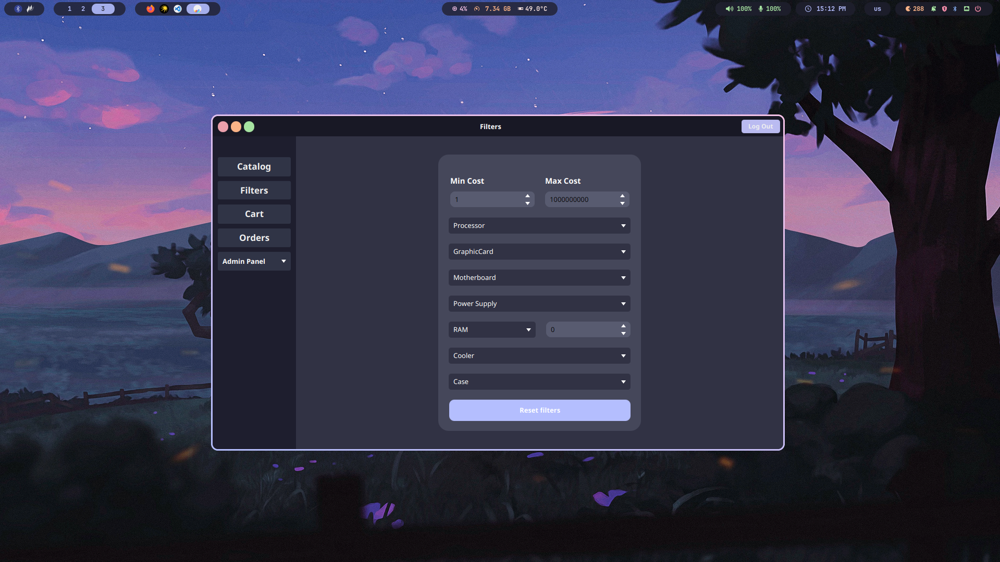
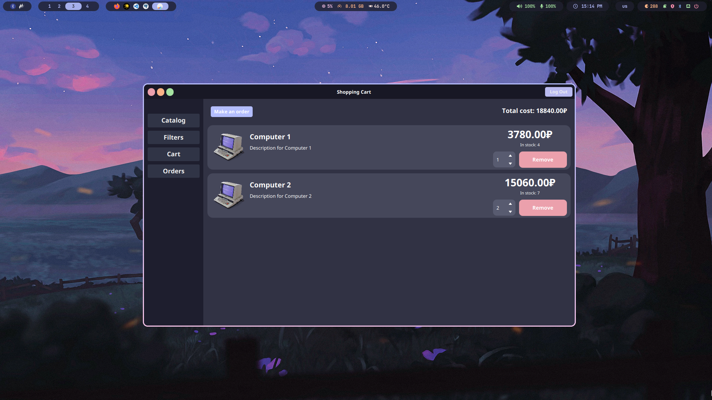
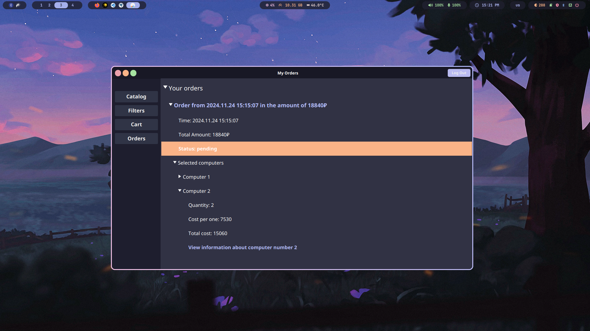
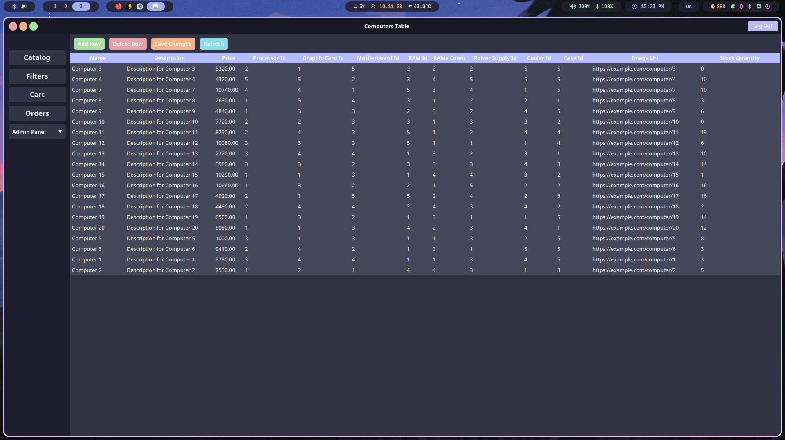

# NexusPC
**NexusPC** — магазин компьютерной техники. \
Проект выполнен в качестве курсовой работы по предмету **"МДК 11.01 Технология разработки и защиты баз данных"** за 3 курс в Нижегородском радиотехническом колледже.

Эта система способствует эффективному управлению запасами, заказами и взаимодействием с клиентами, обеспечивая пользователей необходимой информацией и инструментами для принятия обоснованных решений.

# Описание структуры системы
В рамках данного проекта была разработана информационная система, представляющая собой приложение, предназначенное для функционирования в качестве магазина компьютерной техники. Данная система состоит из восьми взаимосвязанных страниц, каждая из которых выполняет свою уникальную функцию и обеспечивает пользователю доступ к различным аспектам работы с приложением. Основные страницы приложения включают:
- **Регистрация** – страница, на которой пользователи могут создать новый аккаунт, заполнив необходимые поля с личной информацией.
- **Авторизация** – интерфейс для входа в систему, где пользователи вводят свои учетные данные для доступа к функционалу приложения.
- **Каталог товаров** – основная страница, на которой представлены все доступные товары, сгруппированные по категориям.
- **Информация о товаре** – страница, предоставляющая детальную информацию о выбранном товаре, включая его характеристики и цену.
- **Фильтры** – инструмент для сортировки и фильтрации товаров по различным критериям, таким как цена, производитель и технические характеристики.
- **Корзина товаров** – страница, на которой пользователи могут просмотреть добавленные в корзину товары перед оформлением заказа.
- **Заказы** – интерфейс для просмотра истории заказов пользователя и их статусов.
- **Админ панель** – специализированный интерфейс для администраторов, позволяющий управлять данными в системе.

Административная панель включает в себя дополнительные одиннадцать страниц, каждая из которых соответствует отдельной таблице базы данных. Эти таблицы содержат информацию о различных аспектах работы магазина и включают:
- **users** – таблица с данными пользователей приложения.
- **processors** – информация о процессорах, доступных в магазине.
- **graphic_cards** – данные о видеокартах.
- **motherboards** – сведения о материнских платах.
- **power_supplies** – информация о блоках питания.
- **rams** – данные об оперативной памяти.
- **coolers** – информация о системах охлаждения.
- **cases** – сведения о корпусах компьютеров.
- **computers** – таблица с информацией о готовых сборках компьютеров.
- **orders** – данные о заказах пользователей.
- **order_items** – информация о товарах в каждом заказе.

Переходы между страницами приложения реализованы с помощью кнопок и контекстного меню, что обеспечивает удобство навигации для пользователей. 
При запуске приложения пользователь сразу попадает на страницу авторизации. Здесь он может пройти процедуру идентификации, введя свои учетные данные. В случае отсутствия аккаунта имеется возможность перейти к регистрации нового пользователя. 

После успешного ввода данных и нажатия на кнопку **"Login"**, пользователь автоматически перенаправляется на основной интерфейс приложения, где ему становится доступен полный функционал системы.
 
На главной странице пользователя встречает меню каталога товаров. В этом меню представлено обычное перечисление компьютеров с карточками товаров, включающими фотографии, названия и описания. 
Каждая карточка содержит информацию о цене и кнопку **"Add to cart"**, нажатие на которую позволяет добавить выбранный компьютер в корзину. Если пользователь нажимает на область с названием или описанием товара, он попадает на страницу просмотра информации о продукте. На данной странице отображается вся информация из карточки товара с добавлением детальных характеристик компьютера, таких как процессор, видеокарта, материнская плата, блок питания, оперативная память, кулер и корпус. 

Страница фильтров предоставляет пользователю возможность отфильтровать каталог товаров по необходимым комплектующим или интересующим ценовым диапазонам. 

Страница **"Cart"** (корзина товаров) аналогична каталогу товаров, но с дополнительными функциями. Здесь пользователь видит количество товара на складе и виджет для изменения количества выбранного компьютера в заказе. 
Также присутствует кнопка для удаления товара из корзины. В верхней части списка отображается итоговая стоимость заказа и кнопка **"Make an order"** (сделать заказ). 
Если пользователь имеет роль администратора, то данная страница дополнительно включает текстовое поле для указания контактов пользователя, который сделал данный заказ. Это может быть полезно в случаях, когда клиент связывается с магазином по телефону и предоставляет информацию для оформления заказа. 

После завершения оформления заказа пользователь перенаправляется на страницу **"Orders"** (заказы), где он может ознакомиться с подробной информацией обо всех совершенных заказах. Доступная информация включает:
- **дату оформления заказа**
- **итоговую цену заказа**
- **статус выполнения заказа**
- **краткие сведения о компьютерах, приобретенных в конкретном заказе (цены указаны на момент покупки).**

Если у пользователя приложения установлен статус администратора, он получает доступ к кнопке **"admin panel"**, которая открывает контекстное меню с выбором таблицы для редактирования. После выбора соответствующей таблицы открывается страница, на которой отображается таблица с данными во весь экран. В верхней части страницы расположены несколько кнопок управления таблицей:

- **Add row** – добавление новой строки в таблицу,
- **Delete row** – удаление выделенной строки,
- **Save changes** – сохранение всех внесенных изменений в таблице,
- **Refresh** – перезагрузка страницы с обновлением актуальных данных из базы данных.

> ![IMPORTANT]
> В папке `docs` вы можете найти техническое задание, а так-же мою курсовую, в которой есть описание разработки, архитектуры приложения и прочего. 

# Настройка
Создайте следующий файл `connection.prop` и настройте подключение к базе данных PostgreSQL.

Шаблон конфигурации:
```ini
url=jdbc:postgresql://localhost:5432/nexus_pc
username=<❗️YourLogin❗️>
password=<❗️YourPassword❗️>
```

## Тестирование
С помощью SQL кода, написанного в файле `random_data.sql`, Вы можете сгенерировать рандомные данные для всех комплектующих, а так-же для самих компьютеров.

# Обзор









# Вклад в развитие
Вклад в развитие NexusPC приветствуется! Если вы обнаружите какие-либо проблемы или у вас есть идеи по улучшению, не стесняйтесь открывать проблему или отправлять запрос на слияние.

# Лицензия
**NexusPC** распространяется под лицензией GNU GPLv3.

### Разрешения:
- **Коммерческое использование**
- **Модификация**
- **Использование патента** 
- **Частное использование** 

### Условия: 
- **Раскрыть источник** 
- **Лицензия и уведомление об авторских правах** 
- **Та же лицензия** 

### Подробнее смотрите в файле [LICENSE](LICENSE).