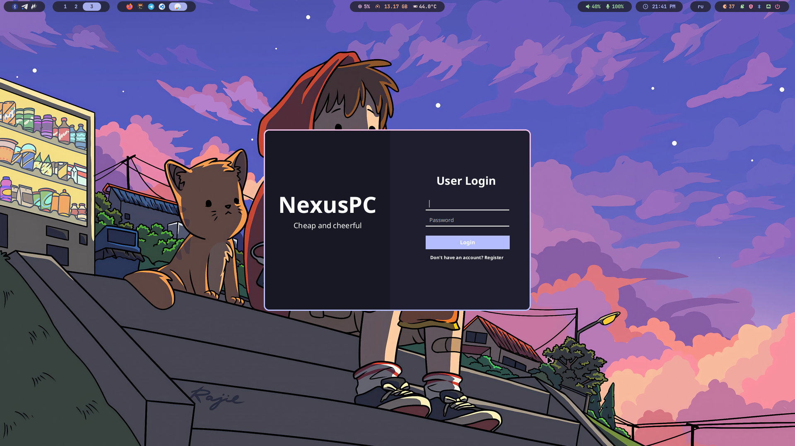
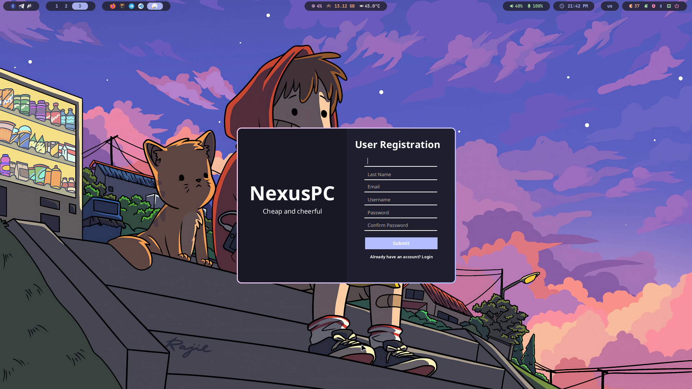

# NexusPC
**NexusPC** — магазин компьютерной техники. \
Проект выполнен в качестве курсовой работы по предмету **"МДК 11.01 Технология разработки и защиты баз данных"** за 3 курс в Нижегородском радиотехническом колледже.

Эта система способствует эффективному управлению запасами, заказами и взаимодействием с клиентами, обеспечивая пользователей необходимой информацией и инструментами для принятия обоснованных решений.

# Ключевые функции
- Многопользовательский доступ: 

    Система поддерживает одновременный доступ для нескольких пользователей, что позволяет осуществлять бесперебойные операции в магазине.


- Функционал по ролям: Разные роли (клиенты и сотрудники) имеют специализированные функции для повышения удобства использования:

    - Клиенты могут:
        Получать оперативную информацию о наличии товаров, их описаниях, изображениях и ценах.
        Искать товары по заданным критериям.
        Фильтровать товары по категориям и производителям.
        Находить подробные описания техники и комплектующих.
        
    - Сотрудники могут:
        Управлять справочниками продуктов: добавлять, удалять или редактировать записи.
        Оформлять заказы от клиентов, которые могут включать несколько товаров в различных количествах.
        Динамически рассчитывать стоимость заказа на основе выбранных товаров.

# Настройка
Создайте следующий файл `connection.prop` и настройте подключение к базе данных PostgreSQL.

Шаблон конфигурации:
```ini
url=jdbc:postgresql://localhost:5432/nexus_pc
username=<❗️YourLogin❗️>
password=<❗️YourPassword❗️>
```

# Обзор



# Вклад в развитие
Вклад в развитие NexusPC приветствуется! Если вы обнаружите какие-либо проблемы или у вас есть идеи по улучшению, не стесняйтесь открывать проблему или отправлять запрос на слияние.

# Лицензия
**NexusPC** распространяется под лицензией GNU GPLv3.

### Разрешения:
- **Коммерческое использование**
- **Модификация**
- **Использование патента** 
- **Частное использование** 

### Условия: 
- **Раскрыть источник** 
- **Лицензия и уведомление об авторских правах** 
- **Та же лицензия** 

### Подробнее смотрите в файле [LICENSE](LICENSE).